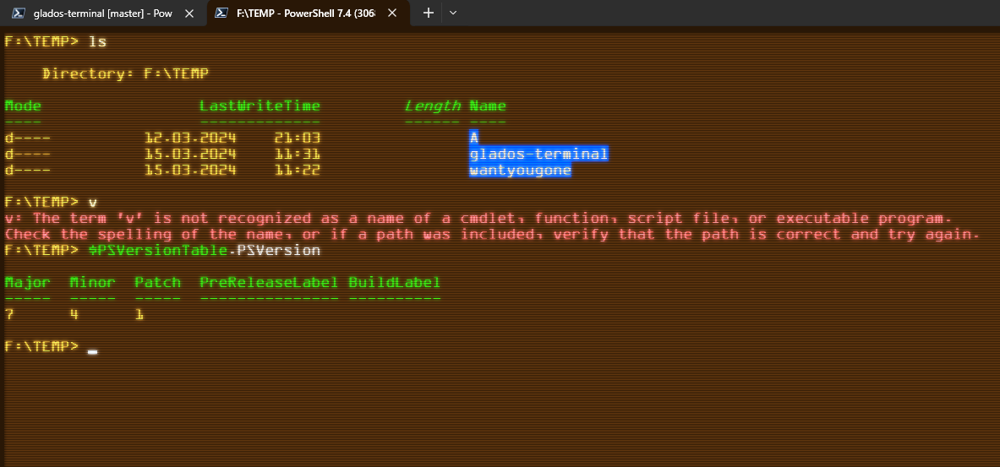

Got it, here's a more concise update to the WYGpython project:

# WYGpython

Literally, the video: https://www.youtube.com/watch?v=lT-NxwrjgZM

This project can be used anywhere, feel free to make it your own and turn your dreams into reality.

## Style your shell



For Windows users, you'll need to use the [Microsoft Terminal](https://github.com/microsoft/terminal). Inside the Terminal, go to Settings > Open JSON file (bottom left corner). There, you can find the profiles and themes in the `/styles/` folder of this repository. Copy and paste the content of the file carefully into the JSON file.

After that, you should be able to find the new "Aperture" profile in your Terminal. Enjoy your new, pretty shell!

## Usage

To use WYGpython, execute `wantyougone.py` using any Python version 3.6 or higher. If you want to start the GUI version, run `start.py` **ONLY USING THE COMMAND PROMPT**.

If you want to create your own lyrics, run `WYGgen.py`. This will create a copy of the lyrics in the `lyrics.txt` file and set the delays for the lyrics you made. The syntax for the lyrics file is as follows:

- `[/f]` - Make the lyrics go faster
- `[/s]` - Make the lyrics go slower
- `[/rs]` - Same as `/s`, but go even more slowly
- `[/ns]` - Sets normal speed
- `[/i]` - Instant speed
- `[/c]` - Clears the screen
- `[/nl]` - **Proper** new line
- `[/d]` - Sets a delay before going to a new line, can be automated with `WYGgen.py`

**Disclaimer: My script is so fucked up that some syntaxes need to be at the end of the line, cant tell who's who because im writing this as it is 3am and working on a website.**

## Examples

```
Hello, I am normal scrolling speed

***[/f]***OOOO I'm fast!! ***[/r]***sanndd I'm slow now

***[/rs]***I'm reallllyyy sloowww ***[/ns]***and I'm normal speed!

***[/i]***INSTANT!!! ***[/nl]***

This is a delay of 2 seconds before going to the next line***[/d2.00]***
```

WYGpython by Juicey is marked with CC0 1.0 Universal. To view a copy of this license, visit http://creativecommons.org/publicdomain/zero/1.0 (that means you can copy it without crediting me :) ).
